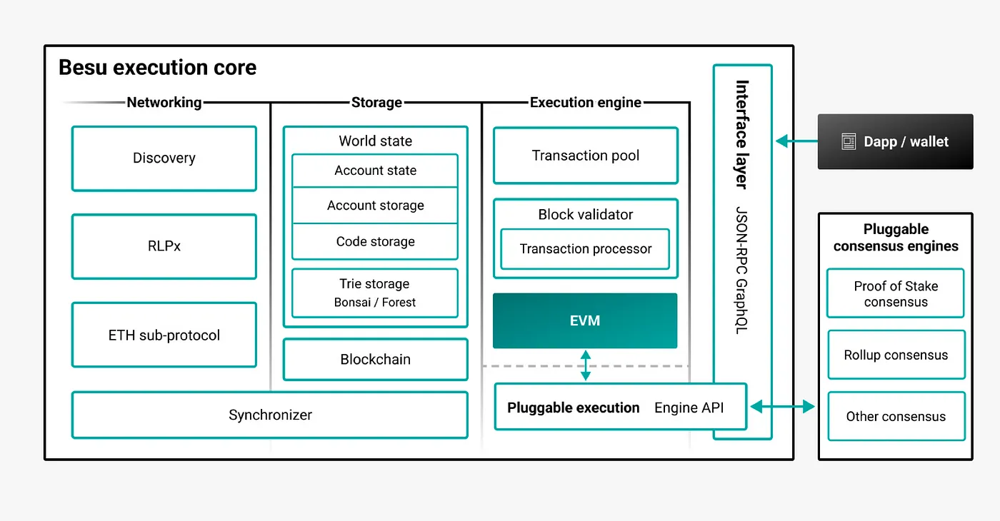

기업에서 사용 될 이더리움 기반 프라이빗 블록체인 대표적으로 Hyperledger Besu에 대해 알아보자.

먼저, 의문점이 있다. 블록체인이란 기본적인 컨셉은 퍼블릭한 투명성을 목표로 탈중앙화가 목표인데, 프라이빗이란 개념이 들어간다는건, 블록체인의 컨셉에 어긋나는게 아닌가?

프라이빗 블록체인의 기본적인 컨셉은 기업이나 개인 환경에서 사용이다.

한마디로, 구축자의 특성에 맞는 또 다른 이더리움 세계를 구축한다는 것이다.

어떤 환경 내에서도 불변성, 투명성이 필요하다. 그래서 특정 환경일때, DB를 사용하지 않고, 이러한 장점이 있는 프라이빗 블록체인을 사용한다.

## Hyperledger Besu

Besu는 EVM을 지원하는 오픈소스이다. 자체 네트워크를 구성 할 수 있는 프라이빗 블록체인 및 이더리움과 연동가능한 퍼블릭 네트워크 구성까지 가능하다.

*아래 그림은 합의 알고리즘에 대한 비교이다.*

### Besu 프라이빗 네트워크 구성도

* 퍼블릭 이더리움과 연결 되지 않는 독립적인 네트워크를 구성하여, 거래의 프라이버시를 유지 및 트랜잭션 처리를 한다.
* 주로 QBFT, IBFT2.0, Clique 등의 합의 알고리즘을 사용한다.

**합의 알고리즘 비교**
1. QBFT(Quorum Byzantine Fault Tolerance): 컨센시스가 J.P. Morgan과 협력하여 개발한 합의 알고리즘으로 기존 IBFT합의 알고리즘을 확장한 것으로, 기업 사용 사례에 맞게 개선된 기능을 제공한다.

2. IBFT (Istanbul Byzantine Fault Tolerance): IBFT는 기존 블록체인에 PBFT(Practical Byzantine Fault Tolerance)를 적용할 때 발생하는 몇 가지 문제를 해결한 것으로 거래의 Finality를 보장하였다.

3. CliquePoA: 기존 go-ethereum에 포함된 기본 PoA(Proof of Authority)합의 알고리즘이다.

4. Raft기반 합의: 빠른 블록 시간, 거래 종결성(Finality), 수요에 따른 블록 생성을 위한 합의 알고리즘이다.

**권한 제어**
1. 노드 권한 제어: 각 노드의 네트워크 참여 여부.

2. 계정 권한 제어: 각 계정의 트랜잭션 혹은 컨트랙트 생성 여부

### Besu 퍼블릭 네트워크 구성도

* 퍼블릭 이더리움과 연동이 가능하고, 이더리움의 실행 클라이언트를 담당한다. 이번 이더리움 Merge 마이그레이션 이후, 합의클라이언트와 실행클라이언트로 나뉘게 된다. Besu 또한 실행 클라이언트 기능을 한다.
* 주로 Teku 합의 클라이언트를 사용한다.

*Reference*

<https://usa.visa.com/solutions/crypto/enterprise-blockchain.html>

<https://blog.web3labs.com/a-comparison-of-ethereum-clients>

<https://blog.web3labs.com/web3development/comparing-byzantine-fault-tolerance-consensus-algorithms>

<https://www.hyperledger.org/blog/why-hyperledger-besu-is-a-top-choice-for-financial-use-cases>

*하이퍼레저 베수와 쿼럼의 Use cases*

[LACChain](https://www.coindesk.com/business/2021/04/08/citi-completes-cross-border-payments-pilot-using-lacchain/)

[RTI Blockchain](https://www.hyperledger.org/learn/webinars/hyperledger-in-depth-an-hour-with-ledger-leopard-supply-chain-traceability)

[Poste Italiane](https://www.hyperledger.org/case-studies/posteitaliane-case-study)

[Onyx Digital Assets](https://www.jpmorgan.com/onyx/content-hub.htm)

[Synaptic Health Alliance](https://newsroom.statefarm.com/blockchain-solution-solves-state-farm-usaa-subrogation-challenge/)