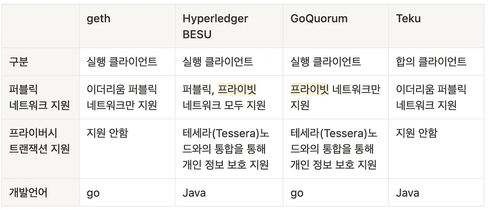
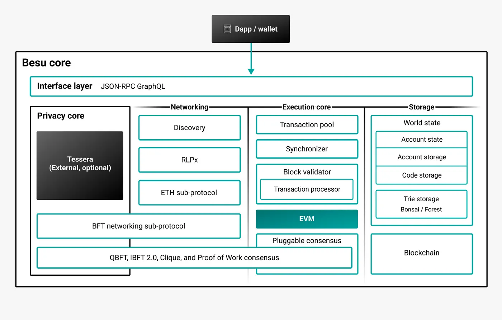

Let's take a look at Hyperledger Besu, one of the representative private blockchains based on Ethereum, used in enterprise environments.

First, there's a question: Blockchain's fundamental concept is aimed at decentralization with a focus on public transparency, so doesn’t the concept of a "private" blockchain contradict that?

The basic concept of a private blockchain is its use in corporate or personal environments.

In short, it means creating another Ethereum world tailored to the needs of the builder.

Immutability and transparency are still necessary in any environment. Therefore, instead of using a traditional database, private blockchains with these advantages are used in specific settings.

## Hyperledger Besu

Besu is an open-source platform that supports EVM. It can be used to create a private blockchain and also connect with Ethereum to form a public network.

*The image below compares different consensus algorithms.*

### Besu Private Network Structure

* It forms an independent network that is not connected to the public Ethereum network, maintaining transaction privacy and processing transactions.
* Commonly used consensus algorithms include QBFT, IBFT 2.0, and Clique.

**Consensus Algorithm Comparison**
1. QBFT (Quorum Byzantine Fault Tolerance): Developed by ConsenSys in collaboration with J.P. Morgan, QBFT is an extension of the IBFT consensus algorithm, offering enhanced features for enterprise use cases.

2. IBFT (Istanbul Byzantine Fault Tolerance): IBFT solves some issues that arise when applying PBFT (Practical Byzantine Fault Tolerance) to blockchains, ensuring transaction finality.

3. Clique PoA: The default Proof of Authority (PoA) consensus algorithm included in go-ethereum.

4. Raft-based Consensus: A consensus algorithm designed for fast block times, transaction finality, and block creation on demand.

**Permission Controls**
1. Node Permission Control: Determines whether each node can participate in the network.

2. Account Permission Control: Determines whether each account can create transactions or contracts.

### Besu Public Network Structure

* It can be connected to the public Ethereum network and acts as an execution client for Ethereum. After the Ethereum Merge migration, it is divided into a consensus client and an execution client, with Besu serving as the execution client.
* The Teku consensus client is commonly used in conjunction with Besu.

*Reference*

<https://usa.visa.com/solutions/crypto/enterprise-blockchain.html>

<https://blog.web3labs.com/a-comparison-of-ethereum-clients>

<https://blog.web3labs.com/web3development/comparing-byzantine-fault-tolerance-consensus-algorithms>

<https://www.hyperledger.org/blog/why-hyperledger-besu-is-a-top-choice-for-financial-use-cases>

*Use cases of Hyperledger Besu and Quorum*

[LACChain](https://www.coindesk.com/business/2021/04/08/citi-completes-cross-border-payments-pilot-using-lacchain/)

[RTI Blockchain](https://www.hyperledger.org/learn/webinars/hyperledger-in-depth-an-hour-with-ledger-leopard-supply-chain-traceability)

[Poste Italiane](https://www.hyperledger.org/case-studies/posteitaliane-case-study)

[Onyx Digital Assets](https://www.jpmorgan.com/onyx/content-hub.htm)

[Synaptic Health Alliance](https://newsroom.statefarm.com/blockchain-solution-solves-state-farm-usaa-subrogation-challenge/)