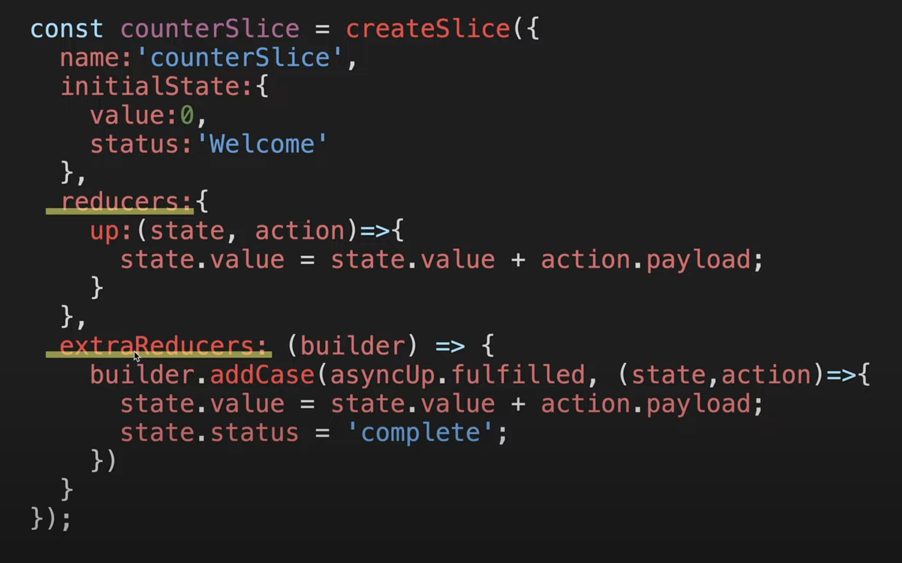

1. `createAsyncThunk` allows you to create actions for handling asynchronous operations.

```js
const asyncUpFetch = createAsyncThunk('counterSlice/asyncUpFetch', async () => {
  const resp = await fetch('https://api.aergo.io/~~')
  const data = await resp.json()
  return data.value
})
```
- createAsyncThunk Flow
  
- While reducers automatically create action creators for you, this is not the case for asynchronous operations. You need to create the action creators manually within `extraReducers`.
  
