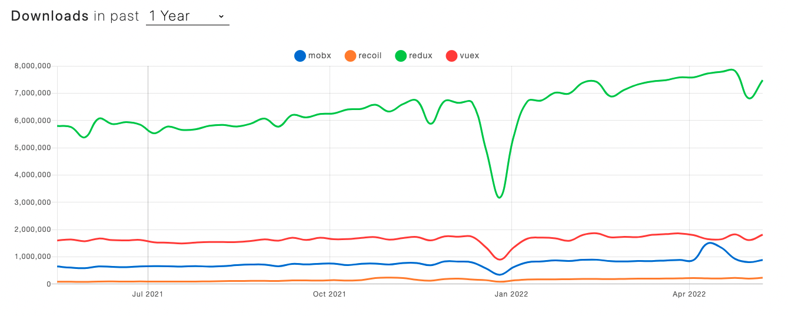

Throughout my projects, I've used Redux for state management.

There are many state management libraries available. Recently, I’ve heard of libraries like MobX, Recoil, Zustand, and so on.



While I haven't applied other state management solutions directly in my projects, the statistics indicate that Redux is overwhelmingly popular.

So far, I haven’t experienced significant inconvenience while using React and Redux.

However, I found the back-and-forth process of changing type definitions, action functions, and reducers in Redux to be cumbersome.

When upgrading to React 18, I discovered that the syntax I had been using was considered "legacy." I vaguely understood that the Redux Toolkit library could alleviate the inconveniences of traditional Redux.

At the time, I was busy with development and tried to apply the methods I found on blogs without thoroughly reading the official documentation.

Ultimately, I failed to refactor my existing Redux code and decided to revert to my well-structured existing Redux code, which I deemed to be fine.

For this new project, I want to explore Redux Toolkit from the beginning, so I’m summarizing my findings here.


**Redux**

1. Redux is a state container
2. The state of the application can change
3. In redux, a pattern is enforced to ensure all state
4. transitions are explicit and can be tracked
   - The changes to your application's state become predictable
   - If you want to manage the global state of your application in a predictable way, redux can help you
   - The patterns and tools provided by Redux make it easier to understand, when, where, why, and how the state in your application is being updated, and how your application logic will behave when those changes occur
   - Redux guides you towords writing code that is predictable and testable, which helps give you confidence that your application will work as exected

**Redux Toolkit**

1. Redux toolkit is the officail, opinionated, batteries-included toolset for efficient Redux development.
2. It is also intended to be the standard way to write Redux logic in your application

**Why Use Redux Toolkit?**

1. Redux is great, but it does have a few shortcomings,

- Configuring redux in an app seems complicated.
- In addition to redux, a lot of other packages have to be installed to get redux to do something useful.
- Redux requires too much boilerplate code

2. Redux toolkit serves as an abstraction over redux. It hides the difficult parts ensuring you have a good developer experience.

**When Should You Use Redux?**

1. You have large amounts of application state that are needed in many places in the app
2. The app state is updated frequently over time
3. The logic to update that state may be complex
4. The app has a medium or large-sized codebase, and might be worked on by many people

**Immer Library**

리덕스 객체를 다룰때, immutable을 유지하기 위해 rest parameter 혹은 배열의 내장함수를 이용해서 불변성을 구현 할 수 있지만, 코드가 복잡해지는 단점이 있다.

immer가 이러한 불변성을 관리 해준다.

**Three Key Concepts**

1. store : holds the state of your application.
2. action : describes what happened in the application
3. reducer : handles the action and decides how to update the state

**Redux Toolkit Syntax**

1. Creating a Store:

```ts
import { configureStore } from "@reduxjs/toolkit";
// ...

export const store = configureStore({
  reducer: {
    posts: postsReducer,
    comments: commentsReducer,
    users: usersReducer,
  },
});

// Infer the `RootState` and `AppDispatch` types from the store itself
export type RootState = ReturnType<typeof store.getState>;
// Inferred type: {posts: PostsState, comments: CommentsState, users: UsersState}
export type AppDispatch = typeof store.dispatch;
```

**Advantages**

1. Using Hooks:
   There was a cumbersome problem of having to declare types every time when using `useDispatch` and `useSelector`. By using hooks, we can eliminate this boilerplate code!

```ts
// hooks/index.ts
import { TypedUseSelectorHook, useDispatch, useSelector } from "react-redux";
import type { RootState, AppDispatch } from "./store";

// Use throughout your app instead of plain `useDispatch` and `useSelector`
export const useAppDispatch = () => useDispatch<AppDispatch>();
export const useAppSelector: TypedUseSelectorHook<RootState> = useSelector;
```

```ts
//? Component that dispatches actions
import { useAppDispatch } from "hooks";
const dispatch = useAppDispatch();
dispatch(리듀서함수());
```

2. CreateSlice Syntax:

```ts
import { createSlice, PayloadAction } from "@reduxjs/toolkit";
import type { RootState } from "../../app/store";

// Define a type for the slice state
interface CounterState {
  value: number;
}

// Define the initial state using that type
const initialState: CounterState = {
  value: 0,
};

export const counterSlice = createSlice({
  name: "counter",
  // `createSlice` will infer the state type from the `initialState` argument
  initialState,
  reducers: {
    increment: (state) => {
      state.value += 1;
    },
    decrement: (state) => {
      state.value -= 1;
    },
    // Use the PayloadAction type to declare the contents of `action.payload`
    incrementByAmount: (state, action: PayloadAction<number>) => {
      state.value += action.payload;
    },
  },
});

export const { increment, decrement, incrementByAmount } = counterSlice.actions;

// Other code such as selectors can use the imported `RootState` type
export const selectCount = (state: RootState) => state.counter.value;

export default counterSlice.reducer;
```

After this, you just need to dispatch the action functions you want to use.
