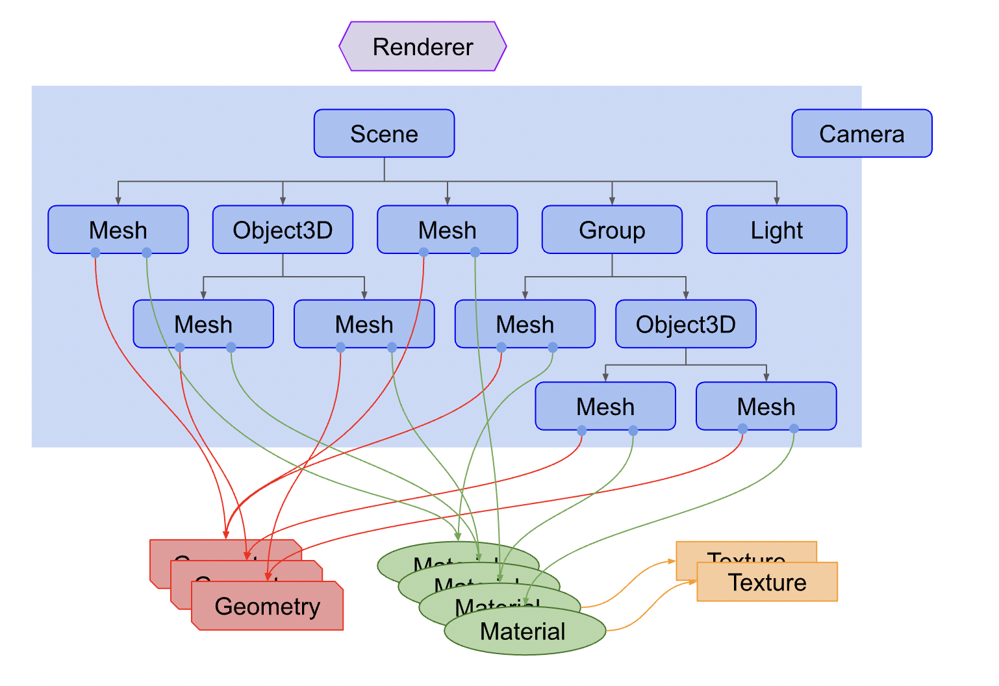

## What is Three.js


- Renderer: Receives Scene and Camera objects and renders the 3D scene as a 2D image.
- Scene Graph: Represents the hierarchical structure of nodes (elements) in the scene.


* Local Space: This space forms based on perspective differences. For example, the Earth orbiting the Sun and the Moon orbiting the Earth create local spaces.

## Three.js + React Basic Tutorial + Code

- Three.js is a library that simplifies creating 3D graphics in the browser.
- It uses Canvas + WebGL to display 3D models and animations.
- react-three-fiber is a React renderer for web and react-native that speeds up creating 3D models and animations with Three.js.

### Using react-three-fiber with Three.js to Structure Code with React State, Hooks, and Props

- mesh: Defines properties that help shape the model.
- hooks: Defines user events in react-three-fiber, such as `onClick` and `onPointerOver`.

```jsx
import React, { useRef, useState, useMemo } from "react";
import { Canvas, useFrame } from "@react-three/fiber";
import * as THREE from "three";
import Doge from "./assets/streamline-icon-dogecoin@400x400.png";
import { OrbitControls, Stars } from "@react-three/drei";
import "./app.css";

const Box = (props) => {
  const mesh = useRef();
  const [active, setActive] = useState(false);

  useFrame(() => {
    mesh.current.rotation.x = mesh.current.rotation.y += 0.01;
  });

  const texture = useMemo(() => new THREE.TextureLoader().load(Doge), []);

  return (
    <mesh
      {...props}
      ref={mesh}
      scale={active ? [2, 2, 2] : [1.5, 1.5, 1.5]}
      onClick={(e) => setActive(!active)}
    >
      <boxBufferGeometry args={[1, 1, 1]} />
      <meshBasicMaterial attach="material" transparent side={THREE.DoubleSide}>
        <primitive attach="map" object={texture} />
      </meshBasicMaterial>
    </mesh>
  );
};

function App() {
  return (
    <Canvas>
      <Stars />
      <ambientLight intensity={0.5} />
      <spotLight position={[10, 10, 10]} angle={0.15} penumbra={1} />
      <pointLight position={[-10, -10, -10]} />
      <Box position={[-1, 0, 0]} />
      <Box position={[2.5, 0, 0]} />
    </Canvas>
  );
}

export default App;
```

### `<BoxBufferGeometry>` vs `<BoxGeometry>`

* `<BoxGeometry>` is easy to manipulate but is less efficient in storage.


```js
To modify vertices:
// with Geometry, you just get vertex 5 and have access to its x...
// AND the methods of the class -> Vector3.add(Vector3)
myGeom.vertices[5].add(new THREE.Vector3(1,2,3))
```

* `<BoxBufferGeometry>` is WebGL-friendly, making it efficient for rendering and storage but challenging to manipulate.

```js
To modify vertices:
// xyz are just numbers, so with a stride of 3
// we select x, then the next two for y and z
// we need to know that the 15th number in this array is x of vertex 5...
const stride = 3
const index = 5
let offset = index * stride
myGeom.attributes.position.array[offset++] += 1 
myGeom.attributes.position.array[offset++] += 2 
myGeom.attributes.position.array[offset  ] += 3
```

* Mesh Event Handlers


[Load 3D Models in glTF Format](https://discoverthreejs.com/book/first-steps/load-models/)