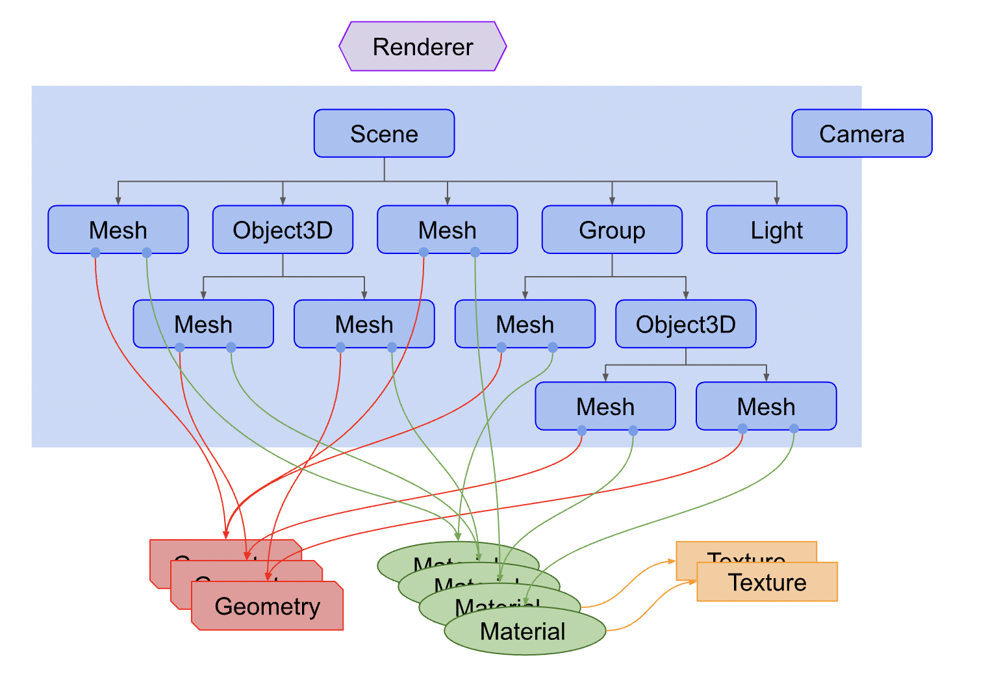
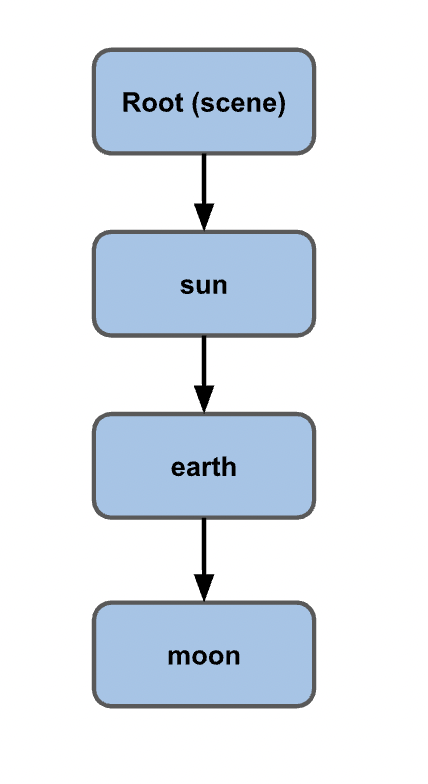

## Three.js란


- Renderer : Scene과 Camera객체를 넘겨 받는다. 3D씬을 평면(2차원) 이미지로 렌더링한다.
- Scene Graph : Node(요소)를 계층구조로 그림으로 나타낸 것.




* 지역공간 : 태양이 봤을때,  태양을 공전하는 지구, 지구를 공전하는 달 , 관점차이로 지역공간이 형성된다.

## Three.js + react 기본 튜토리얼 + 코드

- Three js는 브라우저에서 3D 그래픽을 더 쉽게 생성할 수 있게 해주는 라이브러리입니다
- 캔버스 + WebGL을 사용 하여 3D 모델과 애니메이션을 표시합니다.
- react-three-fiber 는 웹 및 react-native용 React 렌더러 로, Three.js를 사용하여 3D 모델 및 애니메이션을 생성하는 속도를 향상시킵니다.

### react-three-fiberthreeJSReact 상태, 후크 및 소품을 사용하여 코드 구성 요소

- mesh : 모델의 모양을 정의하는 데 도움이 되는 속성
- hooks : react-three-fiber정의 후크 도움이 우리의 도움과 같은 사용자 이벤트를 정의하는 것이 함수를 작성하는 것이 onClick 및 onPointOver

```jsx
import React, { useRef, useState, useMemo } from "react";
import { Canvas, useFrame } from "@react-three/fiber";
import * as THREE from "three";
import Doge from "./assets/streamline-icon-dogecoin@400x400.png";
import { OrbitControls, Stars } from "@react-three/drei";
import "./app.css";

const Box = (props) => {
  const mesh = useRef();
  const [active, setActive] = useState(false);

  useFrame(() => {
    mesh.current.rotation.x = mesh.current.rotation.y += 0.01;
  });

  const texture = useMemo(() => new THREE.TextureLoader().load(Doge), []);

  return (
    <mesh
      {...props}
      ref={mesh}
      scale={active ? [2, 2, 2] : [1.5, 1.5, 1.5]}
      onClick={(e) => setActive(!active)}
    >
      <boxBufferGeometry args={[1, 1, 1]} />
      <meshBasicMaterial attach="material" transparent side={THREE.DoubleSide}>
        <primitive attach="map" object={texture} />
      </meshBasicMaterial>
    </mesh>
  );
};

function App() {
  return (
    <Canvas>
      <Stars />
      <ambientLight intensity={0.5} />
      <spotLight position={[10, 10, 10]} angle={0.15} penumbra={1} />
      <pointLight position={[-10, -10, -10]} />
      <Box position={[-1, 0, 0]} />
      <Box position={[2.5, 0, 0]} />
    </Canvas>
  );
}

export default App;
```

### `<BoxBufferGeometry>` vs `<BoxGeometry>`

* `<BoxGeometry>`는 조작에 좋다. 저장이 잘안되는 단점


```js
정점을 수정하려면..
//with Geometry you just get vertex 5 and have access to it's x...
//AND the methods of the class -> Vector3.add(Vector3)
myGeom.vertices[5].add(new THREE.Vector3(1,2,3))
```

* `<BoxBufferGeometry>` WebGL 친화적인 형식, 렌더링에 좋고 저장하기 좋지만 조작이 힘들다.

```js
정점을 수정하려면..
//xyz are just numbers, so with a stride of 3
//we select x , and  then the next two for y and z
//we have to know that the 15th number in this array is x of vertex 5...
const stride = 3
const index = 5
let offset = index * stride
myGeom.attributes.position.array[offset++] += 1 
myGeom.attributes.position.array[offset++] += 2 
myGeom.attributes.position.array[offset  ] += 3
```

* Mesh 이벤트핸들러


[Load 3D Models in glTF Format](https://discoverthreejs.com/book/first-steps/load-models/)