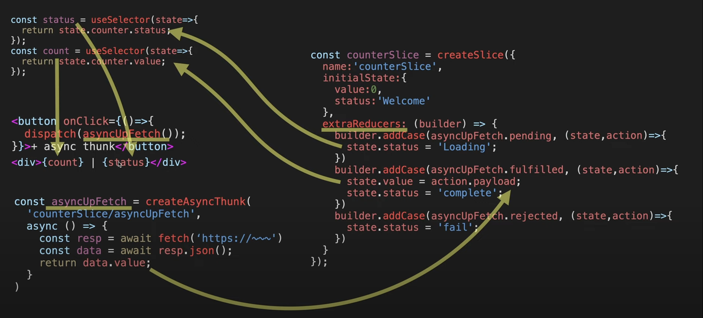

1. createAsyncThunk는 비동기 작업을 처리하는 Action을 만들어준다.

```js
const asyncUpFetch = createAsyncThunk('counterSlice/asyncUpFetch', async () => {
  const resp = await fetch('https://api.aergo.io/~~')
  const data = await resp.json()
  return data.value
})
```
- createAsyncThunk Flow
  
- reducers를 사용하면, actionCreator를 툴킷이 자동으로 만들어주지만, 비동기작업에서는 actionCreator를 자동으로 만들어주지 못하기 때문에, extraReducers에 직접 만들어 주어야 한다.
  
