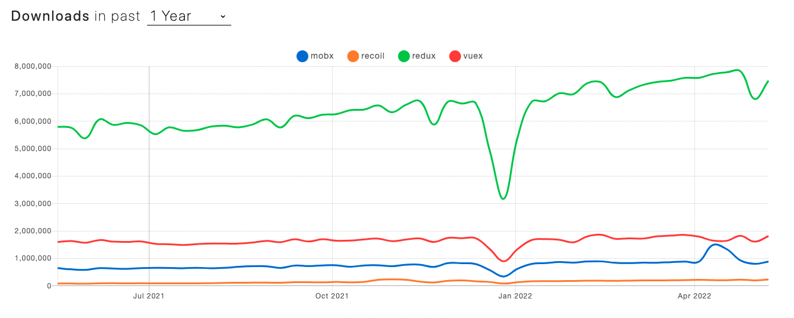

# 인트로

지금껏 프로젝트를 하면서, 리덕스를 사용하여 상태관리를 해왔다.

상태관리 라이브러리는 정말 많다. 최근에 들어본 상태관리 라이브러리는 Mobx , Recoil, Zustand 등등..



다른 상태관리를 직접 프로젝트에서 적용해보진 않았지만, 통계적으로 압도적이다.

지금까지 리액트와 리덕스를 사용하면서 큰 불편함을 느낀적은 없었다.

하지만, 리덕스의 타입정의, 액션함수, 리듀서를 왔다갔다 하며 변경해줘야하는 번거로움이 있었다.

리액트 18버전으로 업그레이드 하면서, 기존에 내가 사용하던 리덕스의 문법이 Legacy한 문법이라고 하여 찾다보니 리덕스 툴킷이라는 라이브러리가 기존의 리덕스의 불편함을 보완 해줄 수 있다고 어렴풋하게 알고있었다.

당시 개발하기 바쁘니깐, 꼼꼼하게 공식문서를 읽어보지 않고, 대충 블로그에서 찾은 방법 그대로 적용하려고 애썼다.

결과적으로 기존의 리덕스 코드를 리팩터링하기에 실패하고,

기존 리덕스 코드 또한 구조도 잘 갖추었고, 문제가 없다고 판단하여, 다시 기존 리덕스 코드로 돌아왔다.

이번 새로운 프로젝트에는 리덕스 툴킷을 처음부터 사용해보고자, 정리하여 글로써 남겨본다.

# 리덕스

1. Redux is a state container
2. The state of the application can change
3. In redux, a pattern is enforced to ensure all state
4. transitions are explicit and can be tracked
   - The changes to your application's state become predictable
   - If you want to manage the global state of your application in a predictable way, redux can help you
   - The patterns and tools provided by Redux make it easier to understand, when, where, why, and how the state in your application is being updated, and how your application logic will behave when those changes occur
   - Redux guides you towords writing code that is predictable and testable, which helps give you confidence that your application will work as exected

# 리덕스 툴킷

1. Redux toolkit is the officail, opinionated, batteries-included toolset for efficient Redux development.
2. It is also intended to be the standard way to write Redux logic in your application

# 리덕스 툴킷을 쓰는 이유

1. Redux is great, but it does have a few shortcomings,

- Configuring redux in an app seems complicated.
- In addition to redux, a lot of other packages have to be installed to get redux to do something useful.
- Redux requires too much boilerplate code

2. Redux toolkit serves as an abstraction over redux. It hides the difficult parts ensuring you have a good developer experience.

# 언제 리덕스를 써야하는가?

1. You have large amounts of application state that are needed in many places in the app
2. The app state is updated frequently over time
3. The logic to update that state may be complex
4. The app has a medium or large-sized codebase, and might be worked on by many people

# Immer 라이브러리

리덕스 객체를 다룰때, immutable을 유지하기 위해 rest parameter 혹은 배열의 내장함수를 이용해서 불변성을 구현 할 수 있지만, 코드가 복잡해지는 단점이 있다.

immer가 이러한 불변성을 관리 해준다.

# 세가지 컨셉

1. store : holds the state of your application.
2. action : describes what happened in the application
3. reducer : handles the action and decides how to update the state

# 리덕스툴킷 문법

1. 스토어 생성

```ts
import { configureStore } from "@reduxjs/toolkit";
// ...

export const store = configureStore({
  reducer: {
    posts: postsReducer,
    comments: commentsReducer,
    users: usersReducer,
  },
});

// Infer the `RootState` and `AppDispatch` types from the store itself
export type RootState = ReturnType<typeof store.getState>;
// Inferred type: {posts: PostsState, comments: CommentsState, users: UsersState}
export type AppDispatch = typeof store.dispatch;
```

# 장점

1. Hooks사용
   매번 useDispatch와 useSelector를 선언할때 타입까지 상태 타입까지 설정해야하는 번거로운 문제가 있었다.
   hooks를 이용하여, 이러한 번거로운 코드를 없애자!!

```ts
// hooks/index.ts
import { TypedUseSelectorHook, useDispatch, useSelector } from "react-redux";
import type { RootState, AppDispatch } from "./store";

// Use throughout your app instead of plain `useDispatch` and `useSelector`
export const useAppDispatch = () => useDispatch<AppDispatch>();
export const useAppSelector: TypedUseSelectorHook<RootState> = useSelector;
```

```ts
//? dispatch를 실행할 컴포넌트
import { useAppDispatch } from "hooks";
const dispatch = useAppDispatch();
dispatch(리듀서함수());
```

2. CreateSlice 문법

```ts
import { createSlice, PayloadAction } from "@reduxjs/toolkit";
import type { RootState } from "../../app/store";

// Define a type for the slice state
interface CounterState {
  value: number;
}

// Define the initial state using that type
const initialState: CounterState = {
  value: 0,
};

export const counterSlice = createSlice({
  name: "counter",
  // `createSlice` will infer the state type from the `initialState` argument
  initialState,
  reducers: {
    increment: (state) => {
      state.value += 1;
    },
    decrement: (state) => {
      state.value -= 1;
    },
    // Use the PayloadAction type to declare the contents of `action.payload`
    incrementByAmount: (state, action: PayloadAction<number>) => {
      state.value += action.payload;
    },
  },
});

export const { increment, decrement, incrementByAmount } = counterSlice.actions;

// Other code such as selectors can use the imported `RootState` type
export const selectCount = (state: RootState) => state.counter.value;

export default counterSlice.reducer;
```

이후, 사용하고 싶은 action함수를 dispatch하면 된다.
